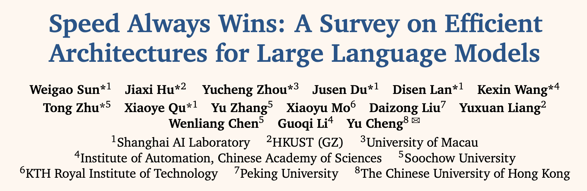
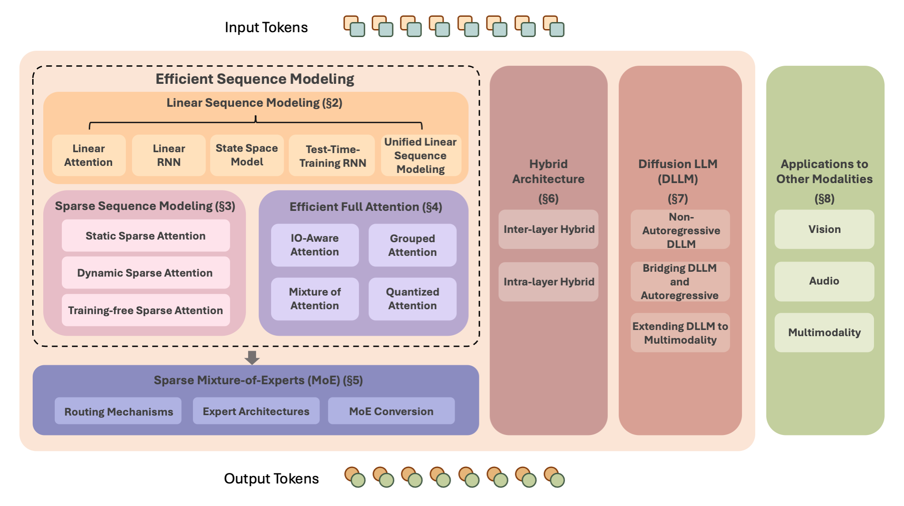
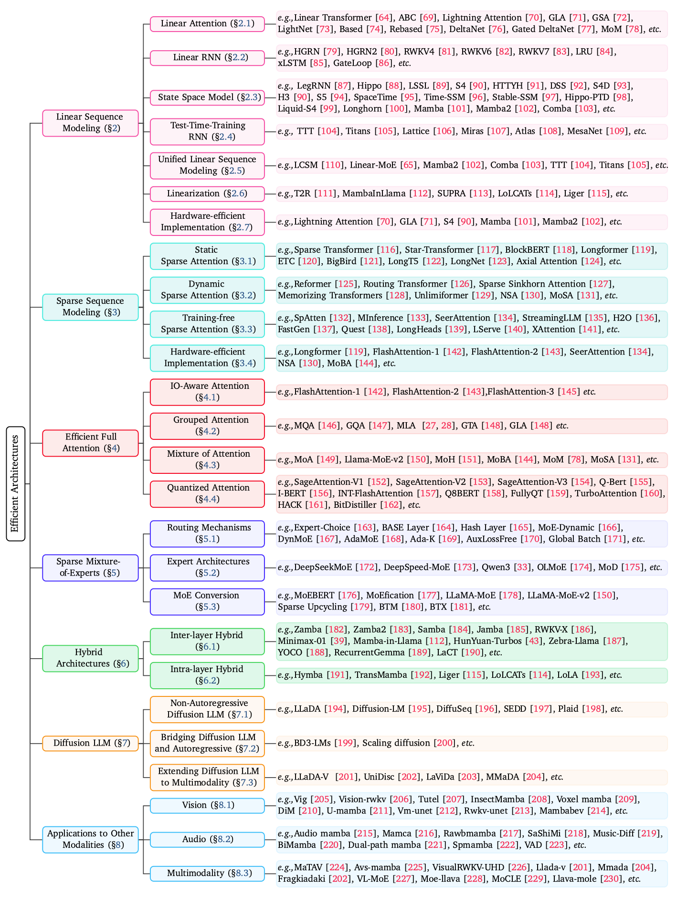

<div align="center">

# Awesome-Efficient-Arch
[](https://awesome.re)
[](https://arxiv.org/pdf/2503.09567) 
[](https://github.com/weigao266/Awesome-Efficient-Arch)
[](https://github.com/weigao266/Awesome-Efficient-Arch)
[]()
</div>

## 🔥 News
- **2025.08**: 🎉🎉🎉 We have released a survey paper [Speed Always Wins: A Survey on Efficient Architectures for Large Language Models](https://arxiv.org/pdf/2508.09834), with **449** papers reviewed. Please feel free to open PRs to include your Awesome-Efficient-Arch work.

## ✨ Overview

<p align="center">
  
</p>

<p align="center">
  
</p>

<p align="center">
  
</p>

## 📄 Paper List

### Table of Contents
- 1 [Introduction](#-introduction)
  - 1.1 [Background](#-background)
  - 1.2 [Position and Contributions](#-position-and-contributions)
- 2 [Linear Sequence Modeling](#-linear-sequence-modeling)
  - 2.1 [Linear Attention](#-linear-attention)
  - 2.2 [Linear RNN](#-linear-rnn)
  - 2.3 [State Space Model](#-state-space-model)
  - 2.4 [Test-Time-Training RNN](#-test-time-training)
  - 2.5 [Unified Linear Sequence Modeling](#-unified-linear-sequence-modeling)
  - 2.6 [Linearization](#-linearization)
  - 2.7 [Hardware-efficient Implementation](#-hardware-efficient-implementation)
- 3 [Sparse Sequence Modeling](#-sparse-sequence-modeling)
  - 3.1 [Static Sparse Attention](#-static-sparse-attention)
  - 3.2 [Dynamic Sparse Attention](#-dynamic-sparse-attention)
  - 3.3 [Training-free Sparse Attention](#-training-free-sparse-attention)
  - 3.4 [Hardware-efficient Implementation](#-hardware-efficient-implementation)
- 4 [Efficient Full Attention](#-efficient-full-attention)
  - 4.1 [IO-Aware Attention](#-io-aware-attention)
  - 4.2 [Grouped Attention](#-grouped-attention)
  - 4.3 [Mixture of Attention](#-mixture-of-attention)
  - 4.4 [Quantized Attention](#-quantized-attention)
- 5 [Sparse Mixture-of-Experts](#-sparse-mixture-of-experts)
  - 5.1 [Routing Mechanisms](#-routing-mechanisms)
  - 5.2 [Expert Architectures](#-expert-architectures)
  - 5.3 [MoE Conversion](#-moe-conversion)
- 6 [Hybrid Architectures](#-hybrid-architectures)
  - 6.1 [Inter-layer Hybrid](#-inter-layer-hybrid)
  - 6.2 [Intra-layer Hybrid](#-intra-layer-hybrid)
- 7 [Diffusion Large Language Models](#-diffusion-large-language-models)
  - 7.1 [Non-Autoregressive Diffusion LLM](#-non-autoregressive-diffusion-llm)
  - 7.2 [Bridging Diffusion LLM and Autoregressive](#-bridging-diffusion-llm-and-autoregressive)
  - 7.3 [Extending Diffusion LLM to Multimodality](#-extending-diffusion-llm-to-multimodality)
- 8 [Applications to Other Modalities](#-applications-to-other-modalities)
  - 8.1 [Vision](#-vision)
  - 8.2 [Audio](#-audio)
  - 8.3 [Multimodality](#-multimodality)
- 9 [Conclusion and Future Directions](#-conclusion-and-future-directions)
---

### Linear Sequence Modeling

#### Linear Attention

- [RWKV-7 "Goose" with Expressive Dynamic State Evolution](https://arxiv.org/abs/2503.14456) 
- [LASP-2: Rethinking Sequence Parallelism for Linear Attention and Its Hybrid](https://arxiv.org/abs/2502.07563) 
- [Native sparse attention: Hardware-aligned and natively trainable sparse attention](https://arxiv.org/abs/2502.11089) 
- [MoBA: Mixture of Block Attention for Long-Context LLMs](https://arxiv.org/abs/2502.13189) 
- [MoM: Linear Sequence Modeling with Mixture-of-Memories](https://arxiv.org/abs/2502.13685) 
- [Gated Delta Networks: Improving Mamba2 with Delta Rule](https://arxiv.org/abs/2412.06464) 
- [Transformers are SSMs: Generalized models and efficient algorithms through structured state space duality](https://arxiv.org/abs/2405.21060) 
- [Various Lengths, Constant Speed: Efficient Language Modeling with Lightning Attention](https://arxiv.org/abs/2405.17381) 
- [Gated linear attention transformers with hardware-efficient training](https://arxiv.org/abs/2312.06635) 

#### Linear RNN

- [Hierarchically Gated Recurrent Neural Network for Sequence Modeling](https://arxiv.org/abs/2311.04823)  
- [HGRN2: Gated Linear RNNs with State Expansion](https://arxiv.org/abs/2404.07904) 
- [RWKV: Reinventing RNNs for the Transformer Era](https://arxiv.org/abs/2305.13048) 
- [Eagle and Finch: RWKV with Matrix-Valued States and Dynamic Recurrence](https://arxiv.org/abs/2404.05892) 
- [RWKV-7" Goose" with Expressive Dynamic State Evolution](https://arxiv.org/abs/2503.14456) 
- [Resurrecting Recurrent Neural Networks for Long Sequences](https://arxiv.org/abs/2303.06349)  
- [xLSTM: Extended Long Short-Term Memory](https://arxiv.org/abs/2405.04517) 
- [GateLoop: Fully Data-Controlled Linear Recurrence for Sequence Modeling](https://arxiv.org/abs/2311.01927) 

#### State Space Model

- [Mamba: Linear‑Time Sequence Modeling with Selective State Spaces](https://arxiv.org/abs/2312.00752) 
- [Transformers are SSMs: Generalized Models and Efficient Algorithms through Structured State Space Duality](https://arxiv.org/abs/2405.21060) 
- [Comba: Improving Nonlinear RNNs with Closed‑loop Control](https://arxiv.org/abs/2506.02475) 
- [Structured State Space Models (S4)](https://arxiv.org/abs/2111.00396) 
- [S5: Simplified State Space Layers for Sequence Modeling](https://arxiv.org/abs/2208.04933) 
- [Hippo: Recurrent Memory with Optimal Polynomial Projections](https://arxiv.org/abs/2008.07669) 
- [Diagonal State Spaces are as Effective as Structured State Spaces](https://proceedings.neurips.cc/paper_files/paper/2022/file/9156b0f6dfa9bbd18c79cc459ef5d61c-Paper-Conference.pdf)) 
- [On the parameterization and initialization of diagonal state space models](https://papers.neurips.cc/paper_files/paper/2022/file/e9a32fade47b906de908431991440f7c-Paper-Conference.pdf) 
- [Liquid‑S4: Liquid Structural State‑Space Models](https://arxiv.org/abs/2209.12951) 
- [Longhorn: State Space Models Are Amortized Online Learners](https://arxiv.org/abs/2407.14207) 
- [Time‑SSM: Simplifying and Unifying State Space Models for Time Series Forecasting](https://arxiv.org/abs/2405.16312) 
- [Effectively Modeling Time Series with Simple Discrete State Spaces](https://arxiv.org/abs/2303.09489) [](http://img.shields.io/badge/ICLR-2023-yellow)
- [Attractor Memory for Long‑Term Time Series Forecasting: A Chaos Perspective](https://arxiv.org/abs/2402.11463) 
- [How to Train Your HiPPO: State Space Models with Generalized Orthogonal Basis Projections](https://arxiv.org/abs/2206.12037) 
- [LSSL: Combining Recurrent, Convolutional, and Continuous‑Time Models with Linear State‑Space Layers](https://arxiv.org/abs/2110.13985) 

#### Test-Time-Training RNN


- [Test‑Time Regression: A Unifying Framework for Designing Sequence Models with Associative Memory](https://arxiv.org/abs/2501.12352) 
- [Titans: Learning to Memorize at Test Time](https://arxiv.org/abs/2501.00663) 
- [MesaNet: Sequence Modeling by Locally Optimal Test‑Time Training](https://arxiv.org/abs/2506.05233) 
- [Atlas: Learning to Optimally Memorize the Context at Test Time](https://arxiv.org/abs/2505.23735) 
- [Test‑Time Training Done Right](https://arxiv.org/abs/2505.23884) 
- [It's All Connected: A Journey Through Test‑Time Memorization, Attentional Bias, Retention, and Online Optimization](https://arxiv.org/abs/2504.13173) 
- [Learning to (Learn at Test Time): RNNs with Expressive Hidden States](https://arxiv.org/abs/2407.04620) 

#### Unified Linear Sequence Modeling
- [Comba: Improving Nonlinear RNNs with Closed‑loop Control](https://arxiv.org/abs/2506.02475) 
- [Test‑Time Regression: A Unifying Framework for Designing Sequence Models with Associative Memory](https://arxiv.org/abs/2501.12352) 
- [MetaLA: Unified Optimal Linear Approximation to Softmax Attention Map](https://arxiv.org/abs/2406.01234)  


#### Linearization

- [LoLA: Low-Rank Linear Attention With Sparse Caching](https://arxiv.org/abs/2505.23666) 
- [Liger: Linearizing Large Language Models to Gated Recurrent Structures](https://arxiv.org/abs/2503.01496)  
- [Llamba: Scaling Distilled Recurrent Models for Efficient Language Processing](https://arxiv.org/abs/2502.14458) 
- [LoLCATs: On Low-Rank Linearizing of Large Language Models](https://arxiv.org/abs/2410.10254)  
- [The Mamba in the Llama: Distilling and Accelerating Hybrid Models](https://arxiv.org/abs/2408.15237)  
- [Transformers to SSMs: Distilling Quadratic Knowledge to Subquadratic Models](https://arxiv.org/abs/2408.10189)  
- [Linearizing Large Language Models](https://arxiv.org/abs/2405.06640)  
- [DiJiang: Efficient Large Language Models through Compact Kernelization](https://arxiv.org/abs/2403.19928)  
- [Fine-Tuning Pre-trained Transformers into Decaying Fast Weights](https://arxiv.org/abs/2210.04243)  
- [Finetuning Pretrained Transformers into RNNs](https://arxiv.org/abs/2103.13076)  

#### Hardware-efficient Implementation

- [FLA: A Triton‑Based Library for Hardware‑Efficient Implementations of Linear Attention Mechanism](https://github.com/fla-org/flash-linear-attention) 
- [Transformers are SSMs: Generalized Models and Efficient Algorithms through Structured State Space Duality](https://arxiv.org/abs/2405.21060) 
- [Comba: Improving Nonlinear RNNs with Closed‑loop Control](https://arxiv.org/abs/2506.02475) 
- [Gated Delta Networks: Improving Mamba2 with Delta Rule](https://arxiv.org/abs/2412.06464) 
- [DeltaNet: Parallelizing Linear Transformers with the Delta Rule over Sequence Length](https://arxiv.org/abs/2406.06484)  
- [Transformers are SSMs: Generalized models and efficient algorithms through structured state space duality](https://arxiv.org/abs/2405.21060) 
- [Gated linear attention transformers with hardware-efficient training](https://arxiv.org/abs/2312.06635) 
- [Gated Slot Attention for Efficient Linear‑Time Sequence Modeling](https://arxiv.org/abs/2409.07146) 


### Sparse Sequence Modeling

#### Static Sparse Attention

- [Generating Long Sequences with Sparse Transformers](https://arxiv.org/abs/1904.10509) 
- [Star-Transformer](https://arxiv.org/abs/1902.09113) 
- [Blockwise Self-Attention for Long Document Understanding](https://arxiv.org/abs/1911.02972) 
- [Longformer: The Long-Document Transformer](https://arxiv.org/abs/2004.05150) 
- [GMAT: Global Memory Augmentation for Transformers](https://arxiv.org/abs/2006.03274) 
- [ETC: Encoding Long and Structured Inputs in Transformers](https://arxiv.org/abs/2004.08483) 
- [BigBird: Transformers for Longer Sequences](https://arxiv.org/abs/2007.14062) 
- [LongT5: Efficient Text-to-Text Transformer for Long Sequences](https://arxiv.org/abs/2112.07916) 
- [LongNet: Scaling Transformers to 1,000,000,000 Tokens](https://arxiv.org/abs/2307.02486) 
- [Axial Attention in Multidimensional Transformers](https://arxiv.org/abs/1912.12180) 
- [Open-Sora: Democratizing Efficient Video Production for All](https://github.com/hpcaitech/Open-Sora) 

#### Dynamic Sparse Attention

- [Reformer: The Efficient Transformer](https://arxiv.org/abs/2001.04451) 
- [Efficient Content-Based Sparse Attention with Routing Transformers](https://aclanthology.org/2021.tacl-1.5) 
- [Sparse Sinkhorn Attention](https://proceedings.mlr.press/v119/tay20a.html) 
- [Memorizing Transformers](https://arxiv.org/abs/2203.08913) 
- [Unlimiformer: Long-Range Transformers with Unlimited Length Input](https://proceedings.neurips.cc/paper_files/paper/2024/hash/849d0ae15110a1a15c4ec99e4d91b99a-Abstract.html) 
- [ColT5: Faster Long-Range Transformers with Conditional Computation](https://arxiv.org/abs/2303.09752) 
- [Mixture of Sparse Attention: Content-Based Learnable Sparse Attention via Expert-Choice Routing](https://arxiv.org/abs/2505.00315) 


#### Training-free Sparse Attention

- [Minference 1.0: Accelerating pre-filling for long-context llms via dynamic sparse attention](https://arxiv.org/abs/2407.02490) 
- [Moa: Mixture of sparse attention for automatic large language model compression](https://arxiv.org/abs/2406.14909) 
- [SeerAttention: Learning Intrinsic Sparse Attention in Your LLMs](https://arxiv.org/abs/2410.13276) 
- [SeerAttention-R: Sparse Attention Adaptation for Long Reasoning](https://arxiv.org/abs/2506.08889) 
- [Spatten: Efficient sparse attention architecture with cascade token and head pruning](https://doi.org/10.1109/HPCA51647.2021.00020) 
- [Efficient streaming language models with attention sinks](https://arxiv.org/abs/2309.17453) 
- [Transformers are multi-state rnns](https://arxiv.org/abs/2401.06104) 
- [H2o: Heavy-hitter oracle for efficient generative inference of large language models](https://arxiv.org/abs/2406.14590) 
- [Model tells you what to discard: Adaptive kv cache compression for llms](https://arxiv.org/abs/2310.01801) 
- [Quest: Query-Aware Sparsity for Efficient Long-Context LLM Inference](https://arxiv.org/abs/2406.10774) 
- [DuoAttention: Efficient long-context llm inference with retrieval and streaming heads](https://arxiv.org/abs/2410.10819) 
- [LServe: Efficient long-sequence llm serving with unified sparse attention](https://arxiv.org/abs/2502.14866) 
- [XAttention: Block sparse attention with antidiagonal scoring](https://arxiv.org/abs/2503.16428) 


#### Hardware-efficient Implementation

- [Longformer: The Long-Document Transformer](https://arxiv.org/abs/2004.05150) 
- [FlashAttention: Fast and Memory-Efficient Exact Attention with IO-Awareness](https://nips.cc/virtual/2022/paper/16344) 
- [FlashAttention-2: Faster Attention with Better Parallelism and Work Partitioning](https://arxiv.org/abs/2307.08691) 
- [SeerAttention: Sparse Attention Adaptation for Long Reasoning](https://arxiv.org/abs/2506.08889) 
- [Native Sparse Attention: Hardware-Aligned and Natively Trainable Sparse Attention](https://arxiv.org/abs/2502.11089) 
- [MoBA: Mixture of Block Attention for Long-Context LLMs](https://arxiv.org/abs/2502.13189) 


  
### Efficient Full Attention

#### IO-Aware Attention

- [FlashAttention: Fast and Memory‑Efficient Exact Attention with IO‑Awareness](https://arxiv.org/abs/2205.14135) 
- [FlashAttention‑2: Faster Attention with Better Parallelism and Work Partitioning](https://arxiv.org/abs/2307.08691) 
- [FlashAttention‑3: Fast and Accurate Attention with Asynchrony and Low‑Precision](https://arxiv.org/abs/2407.08608)  

  
#### Grouped Attention

- [Fast Transformer Decoding: One Write-Head is All You Need](https://arxiv.org/abs/1911.02150) 
- [GQA: Training Generalized Multi-Query Transformer Models from Multi-Head Checkpoints](https://arxiv.org/abs/2305.13245) 
- [DeepSeek-V2: A Strong, Economical, and Efficient Mixture-of-Experts Language Model](https://arxiv.org/abs/2405.04434) 
- [DeepSeek-V3 Technical Report](https://arxiv.org/abs/2412.19437) 
- [Hardware-Efficient Attention for Fast Decoding](https://arxiv.org/abs/2505.21487) 


#### Mixture of Attention

- [MoA: Mixture of Sparse Attention for Automatic Large Language Model Compression](https://arxiv.org/abs/2406.14909) 
- [SwitchHead: Accelerating Transformers with Mixture-of-Experts Attention](https://proceedings.neurips.cc/paper/2024/hash/7ac9b4341bf75e4d8634ae6ee35d52d5-Abstract-Conference-Paper.html) 
- [MoH: Multi-Head Attention as Mixture-of-Head Attention](https://arxiv.org/abs/2410.11842) 
- [LLaMA-MoE v2: Exploring Sparsity of LLaMA from Perspective of Mixture-of-Experts with Post-Training](https://api.semanticscholar.org/CorpusID:274234365) 
- [MoBA: Mixture of Block Attention for Long-Context LLMs](https://arxiv.org/abs/2502.13189) 
- [MoM: Linear Sequence Modeling with Mixture-of-Memories](https://arxiv.org/abs/2502.13685) 
- [Mixture of Sparse Attention: Content-Based Learnable Sparse Attention via Expert-Choice Routing](https://arxiv.org/abs/2505.00315) 

#### Quantized Attention

- [SageAttention: Accurate 8‑Bit Attention for Plug‑and‑Play Inference Acceleration](https://arxiv.org/abs/2410.02367) 
- [SageAttention 2 Technical Report: Accurate 4‑Bit Attention for Plug‑and‑Play Inference Acceleration](https://arxiv.org/abs/2411.10958) 
- [SageAttention 3: Microscaling FP4 Attention for Inference and an Exploration of 8‑Bit Training](https://arxiv.org/abs/2505.11594) 
- [INT‑FlashAttention: Enabling Flash Attention for INT8 Quantization](https://arxiv.org/abs/2409.16997) 
- [Q‑BERT: Hessian‑Based Ultra‑Low‑Precision Quantization of BERT](https://arxiv.org/abs/1910.06188) 
- [Q8BERT: Quantized 8‑Bit BERT](https://arxiv.org/abs/1910.10485) 
- [Fully Quantized Transformer for Machine Translation](https://arxiv.org/abs/1910.10485) 
- [I‑BERT: Integer‑Only BERT Quantization](https://arxiv.org/abs/2101.01321) 
- [BitDistiller: Unleashing the Potential of Sub‑4‑Bit LLMs via Self‑Distillation](https://arxiv.org/abs/2402.10631) 


### Sparse Mixture-of-Experts

#### Routing Mechanisms

- [GShard: Scaling Giant Models with Conditional Computation and Automatic Sharding](https://arxiv.org/abs/2006.16668) 
- [Switch Transformers: Scaling to Trillion Parameter Models with Simple and Efficient Sparsity](https://arxiv.org/abs/2101.03961) 
- [Mixture-of-Experts with Expert Choice Routing](https://arxiv.org/abs/2202.09368) 
- [BASE Layers: Simplifying Training of Large, Sparse Models](https://arxiv.org/abs/2103.16716) 
- [Hash Layers For Large Sparse Models](https://arxiv.org/abs/2106.04426) 
- [Harder Tasks Need More Experts: Dynamic Routing in MoE Models](https://arxiv.org/abs/2403.07652) 
- [Dynamic Mixture of Experts: An Auto-Tuning Approach for Efficient Transformer Models](https://arxiv.org/abs/2405.14297) 
- [Ada-K Routing: Boosting the Efficiency of MoE-based LLMs](https://arxiv.org/abs/2410.10456v1) 
- [AdaMoE: Token-Adaptive Routing with Null Experts for Mixture-of-Experts Language Models](https://www.arxiv.org/abs/2406.13233v2) 
- [MoE++: Accelerating Mixture-of-Experts Methods with Zero-Computation Experts](https://arxiv.org/abs/2410.07348) 
- [ReMoE: Fully Differentiable Mixture-of-Experts with ReLU Routing](https://arxiv.org/abs/2412.14711) 
- [BlockFFN: Towards End-Side Acceleration-Friendly Mixture-of-Experts with Chunk-Level Activation Sparsity](https://arxiv.org/abs/2507.08771) 
- [Demons in the Detail: On Implementing Load Balancing Loss for Training Specialized Mixture-of-Expert Models](https://arxiv.org/abs/2501.11873) 
- [Auxiliary-Loss-Free Load Balancing Strategy for Mixture-of-Experts](https://arxiv.org/abs/2408.15664) 


#### Expert Architectures

- [From Sparse to Soft Mixtures of Experts](https://arxiv.org/abs/2308.00951) 
- [OLMoE: Open Mixture-of-Experts Language Models](https://arxiv.org/abs/2409.02060) 
- [DeepSeekMoE: Towards Ultimate Expert Specialization in Mixture-of-Experts Language Models](https://arxiv.org/abs/2401.06066) 
- [Qwen1.5-MoE: Matching 7B Model Performance with 1/3 Activated Parameters](https://qwenlm.github.io/blog/qwen-moe/) 
- [Mixture-of-Depths: Dynamically allocating compute in transformer-based language models](https://arxiv.org/abs/2404.02258) 
- [Mixture-of-Recursions: Learning Dynamic Recursive Depths for Adaptive Token-Level Computation](https://arxiv.org/abs/2507.10524) 
- [ModuleFormer: Modularity Emerges from Mixture-of-Experts](https://arxiv.org/abs/2306.04640) 
- [LoRAMoE: Alleviate World Knowledge Forgetting in Large Language Models via MoE-Style Plugin](https://arxiv.org/abs/2312.09979) 
- [MoELoRA: Contrastive Learning Guided Mixture of Experts on Parameter-Efficient Fine-Tuning for Large Language Models](https://arxiv.org/abs/2402.12851) 
- [Mixture of LoRA Experts](https://arxiv.org/abs/2404.13628) 
- [Mixture of A Million Experts](https://arxiv.org/abs/2407.04153) 


#### MoE Conversion

- [MoEfication: Transformer Feed-forward Layers are Mixtures of Experts](https://arxiv.org/abs/2110.01786) 
- [Sparse Upcycling: Training Mixture-of-Experts from Dense Checkpoints](https://arxiv.org/abs/2212.05055) 
- [MoEBERT: from BERT to Mixture-of-Experts via Importance-Guided Adaptation](https://arxiv.org/abs/2204.07675) 
- [LLaMA-MoE: Building Mixture-of-Experts from LLaMA with Continual Pre-training](https://arxiv.org/abs/2406.16554) 
- [LLaMA-MoE v2: Exploring Sparsity of LLaMA from Perspective of Mixture-of-Experts with Post-Training](https://arxiv.org/abs/2411.15708) 
- [DLO: Dynamic Layer Operation for Efficient Vertical Scaling of LLMs](https://arxiv.org/abs/2407.11030) 
- [MoDification: Mixture of Depths Made Easy](https://arxiv.org/abs/2410.14268v1) 
- [Branch-Train-Merge: Embarrassingly Parallel Training of Expert Language Models](https://arxiv.org/abs/2208.03306) 
- [Branch-Train-MiX: Mixing Expert LLMs into a Mixture-of-Experts LLM](https://arxiv.org/abs/2403.07816) 


### Hybrid Architectures

#### Inter-layer Hybrid

- [Zamba: A Compact 7B SSM Hybrid Model](https://arxiv.org/abs/2405.16712) 
- [Zamba2 Suite: Technical Report](https://arxiv.org/abs/2411.15242) 
- [Samba: Simple Hybrid State Space Models for Efficient Unlimited Context Language Modeling](https://arxiv.org/abs/2406.07522) 
- [Jamba: A Hybrid Transformer-Mamba Language Model](https://arxiv.org/abs/2403.19887) 
- [RWKV-X: A Linear Complexity Hybrid Language Model](https://arxiv.org/abs/2504.21463) 
- [Minimax-01: Scaling Foundation Models with Lightning Attention](https://arxiv.org/abs/2501.08313) 
- [The mamba in the llama: Distilling and Accelerating Hybrid Models](https://nips.cc/virtual/2024/paper/62432) 
- [HunYuan-TurboS: Advancing Large Language Models through Mamba-Transformer Synergy and Adaptive Chain-of-Thought](https://arxiv.org/abs/2505.15431) 
- [Zebra-Llama: Towards Extremely Efficient Hybrid Models](https://arxiv.org/abs/2505.17272) 
- [YOCO: You Only Cache Once: Decoder-Decoder Architectures for Language Models](https://nips.cc/virtual/2024/paper/7339) 
- [RecurrentGemma: Moving Past Transformers for Efficient Open Language Models](https://arxiv.org/abs/2404.07839) 
- [LaCT: Test-time Training Done Right](https://arxiv.org/abs/2505.23884) 


  
#### Intra-layer Hybrid

- [Hymba: A Hybrid-head Architecture for Small Language Models](https://arxiv.org/abs/2411.13676) 
- [WuNeng: Hybrid State with Attention](https://arxiv.org/abs/2504.19191) 
- [TransMamba: Flexibly Switching between Transformer and Mamba](https://arxiv.org/abs/2503.24067) 
- [Liger: Linearizing Large Language Models to Gated Recurrent Structures](https://arxiv.org/abs/2503.01496) 
- [LoLCATs: On Low-Rank Linearizing of Large Language Models](https://arxiv.org/abs/2410.10254) 
- [LoLA: Low-Rank Linear Attention With Sparse Caching](https://arxiv.org/abs/2505.23666) 


### Diffusion Large Language Models 

#### Non-Autoregressive Diffusion LLM

- [Large Language Diffusion Models](https://arxiv.org/abs/2502.09992) 

- [Discrete Diffusion Modeling by Estimating the Ratios of the Data Distribution](https://arxiv.org/abs/2310.16834) 

- [Likelihood-Based Diffusion Language Models](https://arxiv.org/abs/2305.18619) 

- [DiffuSeq: Sequence to Sequence Text Generation with Diffusion Models](https://arxiv.org/abs/2210.08933) 

- [Diffusion-LM Improves Controllable Text Generation](https://arxiv.org/abs/2205.14217) 

  
#### Bridging Diffusion LLM and Autoregressive


- [BLOCK DIFFUSION: INTERPOLATING BETWEEN AUTOREGRESSIVE AND DIFFUSION LANGUAGE MODELS](https://arxiv.org/abs/2503.09573) 

- [Scaling Diffusion Language Models via Adaptation from Autoregressive Models](https://arxiv.org/abs/2410.17891) 


#### Extending Diffusion LLM to Multimodality


- [LLaDA-V: Large Language Diffusion Models with Visual Instruction Tuning](https://arxiv.org/abs/2505.16933) 

- [Unified Multimodal Discrete Diffusion](https://arxiv.org/abs/2503.20853) 

- [LaViDa: A Large Diffusion Language Model for Multimodal Understanding](https://arxiv.org/abs/2505.16839) 

- [MMaDA: Multimodal Large Diffusion Language Models](https://arxiv.org/abs/2505.15809) 

- [Dimple: Discrete Diffusion Multimodal Large Language Model with Parallel Decoding](https://arxiv.org/abs/2505.16990) 


### Applications to Other Modalities

#### Vision

- [Res-vmamba: Fine-grained food category visual classification using selective state space models with deep residual learning](https://arxiv.org/abs/2402.15761) 
- [Rsmamba: Remote sensing image classification with state space model](https://arxiv.org/abs/2403.19654) 
- [InsectMamba: State Space Model with Adaptive Composite Features for Insect Recognition](https://ieeexplore.ieee.org/document/10888139/) 
- [Spectralmamba: Efficient mamba for hyperspectral image classification](https://arxiv.org/abs/2404.08489) 
- [Medmamba: Vision mamba for medical image classification](https://arxiv.org/abs/2403.03849) 
- [Mammil: Multiple instance learning for whole slide images with state space models](https://arxiv.org/abs/2403.05160) 
- [Memorymamba: Memory-augmented state space model for defect recognition](https://arxiv.org/abs/2405.03673) 
- [Scaling Vision with Sparse Mixture of Experts](https://arxiv.org/abs/2106.05974) 
- [Robust Mixture-of-Expert Training for Convolutional Neural Networks](https://arxiv.org/abs/2308.10110) 
- [Patch-level Routing in Mixture-of-Experts is Provably Sample-efficient for Convolutional Neural Networks](https://arxiv.org/abs/2306.04073) 
- [Fusion-Mamba for Cross-Modality Object Detection](https://arxiv.org/abs/2404.09146) 
- [SOAR: Advancements in Small Body Object Detection for Aerial Imagery Using State Space Models and Programmable Gradients](https://arxiv.org/abs/2405.01699) 
- [Mamba YOLO: SSMs-based YOLO for Object Detection](https://arxiv.org/abs/2406.05835v1) 
- [MiM-ISTD: Mamba-in-Mamba for Efficient Infrared Small Target Detection](https://arxiv.org/abs/2403.02148) 
- [Voxel Mamba: Group-Free State Space Models for Point Cloud Based 3D Object Detection](https://arxiv.org/abs/2406.10700) 
- [HTD-Mamba: Efficient Hyperspectral Target Detection with Pyramid State Space Model](https://arxiv.org/abs/2407.06841) 
- [ViG: Linear-Complexity Visual Sequence Learning with Gated Linear Attention](https://arxiv.org/abs/2405.18425) 
- [Vision-RWKV: Efficient and Scalable Visual Perception with RWKV-Like Architectures](https://arxiv.org/abs/2403.02308) 
- [Tutel: Adaptive Mixture-of-Experts at Scale](https://arxiv.org/abs/2206.03382) 
- [Mamba or RWKV: Exploring High-Quality and High-Efficiency Segment Anything Model](https://arxiv.org/abs/2406.19369) 
- [Vision Mamba-based Autonomous Crack Segmentation on Concrete, Asphalt, and Masonry Surfaces](https://arxiv.org/abs/2406.16518) 
- [SegMAN: Omni-scale Context Modeling with State Space Models and Local Attention for Semantic Segmentation](https://arxiv.org/abs/2412.11890) 
- [PyramidMamba: Rethinking Pyramid Feature Fusion with Selective Space State Model for Semantic Segmentation of Remote Sensing Imagery](https://arxiv.org/abs/2406.10828) 
- [PixMamba: Leveraging State Space Models in a Dual-Level Architecture for Underwater Image Enhancement](https://arxiv.org/abs/2406.08444) 
- [WaterMamba: Visual State Space Model for Underwater Image Enhancement](https://arxiv.org/abs/2405.08419) 
- [MambaUIE\&SR: Unraveling the Ocean's Secrets with Only 2.8 GFLOPs](https://arxiv.org/abs/2404.13884) 
- [RetinexMamba: Retinex-Based Mamba for Low-Light Image Enhancement](https://arxiv.org/abs/2405.03349) 
- [LLEMamba: Low-Light Enhancement via Relighting-Guided Mamba with Deep Unfolding Network](https://arxiv.org/abs/2406.01028) 
- [FourierMamba: Fourier Learning Integration with State Space Models for Image Deraining](https://arxiv.org/abs/2405.19450) 
- [Mamba-based Light Field Super-Resolution with Efficient Subspace Scanning](https://arxiv.org/abs/2406.16083) 
- [LFMamba: Light Field Image Super-Resolution with State Space Model](https://arxiv.org/abs/2406.12463) 
- [HDMba: Hyperspectral Remote Sensing Imagery Dehazing with State Space Model](https://arxiv.org/abs/2406.05700) 
- [BVI-RLV: A Fully Registered Dataset and Benchmarks for Low-Light Video Enhancement](https://arxiv.org/abs/2407.03535) 
- [FD-Vision Mamba for Endoscopic Exposure Correction](https://arxiv.org/abs/2402.06378) 
- [StyleRWKV: High-Quality and High-Efficiency Style Transfer with RWKV-like Architecture](https://arxiv.org/abs/2412.19535) 
- [U-Shaped Vision Mamba for Single Image Dehazing](https://arxiv.org/abs/2402.04139) 
- [DVMSR: Distillated Vision Mamba for Efficient Super-Resolution](https://arxiv.org/abs/2405.03008) 
- [Sparse Reconstruction of Optical Doppler Tomography Based on State Space Model](https://arxiv.org/abs/2404.17484) 
- [VmambaIR: Visual State Space Model for Image Restoration](https://arxiv.org/abs/2403.11423) 
- [CU-Mamba: Selective State Space Models with Channel Learning for Image Restoration](https://arxiv.org/abs/2404.11778) 
- [Serpent: Scalable and Efficient Image Restoration via Multi-Scale Structured State Space Models](https://arxiv.org/abs/2403.17902) 
- [GMSR: Gradient-Guided Mamba for Spectral Reconstruction from RGB Images](https://arxiv.org/abs/2405.07777) 
- [Q-MambaIR: Accurate Quantized Mamba for Efficient Image Restoration](https://arxiv.org/abs/2503.21970) 
- [MatIR: A Hybrid Mamba-Transformer Image Restoration Model](https://arxiv.org/abs/2501.18401) 
- [Exploring Real & Synthetic Dataset and Linear Attention in Image Restoration](https://arxiv.org/abs/2412.03814) 
- [Restore-RWKV: Efficient and Effective Medical Image Restoration with RWKV](https://arxiv.org/abs/2407.11087) 
- [RainRWKV: A Deep RWKV Model for Video Deraining](https://link.springer.com/article/10.1007/s00371-025-03965-y) 
- [Multiple Span Bidirectional RWKV Network for Infrared Image Super-Resolution](https://link.springer.com/article/10.1007/s13042-025-02644-7) 
- [Multi-View Learning with Context-Guided Receptance for Image Denoising](https://arxiv.org/abs/2505.02705) 
- [ID-RWKV: Image Deraining RWKV](https://ieeexplore.ieee.org/abstract/document/10889384) 
- [Scalable Diffusion Models with State Space Backbone](https://arxiv.org/abs/2402.05608) 
- [Gamba: Marry Gaussian Splatting With Mamba for Single-View 3D Reconstruction](https://arxiv.org/abs/2403.18795) 
- [Zigma: A DiT-Style Zigzag Mamba Diffusion Model](https://arxiv.org/abs/2403.13802) 
- [DiM: Diffusion Mamba for Efficient High-Resolution Image Synthesis](https://arxiv.org/abs/2405.14224) 
- [Efficient 3D Shape Generation via Diffusion Mamba with Bidirectional SSMs](https://arxiv.org/abs/2406.05038) 
- [Scaling Diffusion Mamba with Bidirectional SSMs for Efficient Image and Video Generation](https://arxiv.org/abs/2405.15881) 
- [Dimba: Transformer-Mamba Diffusion Models](https://arxiv.org/abs/2406.01159) 
- [Scalable Autoregressive Image Generation with Mamba](https://arxiv.org/abs/2408.12245) 
- [MaskMamba: A Hybrid Mamba-Transformer Model for Masked Image Generation](https://arxiv.org/abs/2409.19937) 
- [SDiT: Spiking Diffusion Model with Transformer](https://arxiv.org/abs/2402.11588) 
- [Diffusion-RWKV: Scaling RWKV-like Architectures for Diffusion Models](https://arxiv.org/abs/2404.04478) 
- [Vision Mamba for Classification of Breast Ultrasound Images](https://arxiv.org/abs/2407.03552) 
- [MambaMIL: Enhancing Long Sequence Modeling with Sequence Reordering in Computational Pathology](https://arxiv.org/abs/2403.06800) 
- [U-Mamba: Enhancing Long-Range Dependency for Biomedical Image Segmentation](https://arxiv.org/abs/2401.04722) 
- [VM-UNet: Vision Mamba UNet for Medical Image Segmentation](https://arxiv.org/abs/2402.02491) 
- [SegMamba: Long-Range Sequential Modeling Mamba for 3D Medical Image Segmentation](https://arxiv.org/abs/2401.13560) 
- [MambaMIR: An Arbitrary-Masked Mamba for Joint Medical Image Reconstruction and Uncertainty Estimation](https://arxiv.org/abs/2402.18451) 
- [MMR-Mamba: Multi-Contrast MRI Reconstruction with Mamba and Spatial-Frequency Information Fusion](https://arxiv.org/abs/2406.18950) 
- [VMambaMorph: A Visual Mamba-Based Framework with Cross-Scan Module for Deformable 3D Image Registration](https://arxiv.org/abs/2404.05105) 
- [I2I-Mamba: Multi-Modal Medical Image Synthesis via Selective State Space Modeling](https://arxiv.org/abs/2405.14022) 
- [Motion-Guided Dual-Camera Tracker for Endoscope Tracking and Motion Analysis in a Mechanical Gastric Simulator](https://arxiv.org/abs/2403.05146) 
- [BSBP-RWKV: Background Suppression with Boundary Preservation for Efficient Medical Image Segmentation](https://dl.acm.org/doi/10.1145/3664647.3681033) 
- [Restore-RWKV: Efficient and Effective Medical Image Restoration with RWKV](https://arxiv.org/abs/2407.11087) 
- [Zig-RiR: Zigzag RWKV-in-RWKV for Efficient Medical Image Segmentation](https://ieeexplore.ieee.org/document/10969076) 
- [RWKV-UNet: Improving UNet with Long-Range Cooperation for Effective Medical Image Segmentation](https://arxiv.org/abs/2501.08458) 
- [RNN-Based Multiple Instance Learning for the Classification of Histopathology Whole Slide Images](https://link.springer.com/chapter/10.1007/978-981-97-1335-6_29) 
- [Delta-WKV: A Novel Meta-in-Context Learner for MRI Super-Resolution](https://arxiv.org/abs/2502.20852) 
- [H-MBA: Hierarchical MamBa Adaptation for Multi-Modal Video Understanding in Autonomous Driving](https://arxiv.org/abs/2501.04302) 
- [MambaBEV: An Efficient 3D Detection Model with Mamba2](https://arxiv.org/abs/2410.12673) 
- [Trajectory Mamba: Efficient Attention-Mamba Forecasting Model Based on Selective SSM](https://arxiv.org/abs/2503.10898) 
- [DRaMa: An Efficient End-to-End Motion Planner for Autonomous Driving with Mamba](https://arxiv.org/abs/2408.03601) 
- [Enhancing Autonomous Driving Perception With Mamba-Based Dual-Branch Depth Estimation](https://www.scilit.com/publications/542c8a070890e31c434de97aeb0f8240) 
- [SalM²: An Extremely Lightweight Saliency Mamba Model for Real-Time Cognitive Awareness of Driver Attention](https://www.arxiv.org/abs/2502.16214) 
- [OccRWKV: Rethinking Efficient 3D Semantic Occupancy Prediction with Linear Complexity](https://arxiv.org/abs/2409.19987) 
- [RS-Mamba: Large Remote Sensing Image Dense Prediction with State Space Models](https://arxiv.org/abs/2404.02668) 
- [HSIMamba: Hyperspectral Imaging Efficient Feature Learning with Bidirectional State Space for Classification](https://arxiv.org/abs/2404.00272) 
- [RS3Mamba: Visual State Space Model for Remote Sensing Image Semantic Segmentation](https://arxiv.org/abs/2404.02457) 
- [Samba: Semantic Segmentation of Remotely Sensed Images with State Space Model](https://arxiv.org/abs/2404.01705) 
- [ChangeMamba: Remote Sensing Change Detection with Spatio-Temporal State Space Model](https://arxiv.org/abs/2404.03425) 
- [Pan-Mamba: Effective Pan-Sharpening with State Space Model](https://arxiv.org/abs/2402.12192) 
- [RSCaMa: Remote Sensing Image Change Captioning with State Space Model](https://arxiv.org/abs/2404.18895) 
- [RSDehamba: Lightweight Vision Mamba for Remote Sensing Satellite Image Dehazing](https://arxiv.org/abs/2405.10030) 
- [Frequency-Assisted Mamba for Remote Sensing Image Super-Resolution](https://arxiv.org/abs/2405.04964) 
- [A Novel State Space Model with Local Enhancement and State Sharing for Image Fusion](https://arxiv.org/abs/2404.09293) 


#### Audio

- [RawBMamba: End-to-End Bidirectional State Space Model for Audio Deepfake Detection](https://arxiv.org/abs/2406.06086) 
- [Audio Mamba: Pretrained Audio State Space Model for Audio Tagging](https://arxiv.org/abs/2405.13636) 
- [Audio Mamba: Selective State Spaces for Self-Supervised Audio Representations](https://arxiv.org/abs/2406.02178) 
- [Audio Mamba: Bidirectional State Space Model for Audio Representation Learning](https://arxiv.org/abs/2406.03344) 
- [SSAMBA: Self-Supervised Audio Representation Learning with Mamba State Space Model](https://arxiv.org/abs/2405.11831) 
- [It’s Raw! Audio Generation with State-Space Models](https://arxiv.org/abs/2202.09729) 
- [Multichannel Long-Term Streaming Neural Speech Enhancement for Static and Moving Speakers](https://arxiv.org/abs/2403.07675) 
- [Dual-path Mamba: Short and Long-term Bidirectional Selective Structured State Space Models for Speech Separation](https://arxiv.org/abs/2403.18257) 
- [SPMamba: State-Space Model is All You Need in Speech Separation](https://arxiv.org/abs/2404.02063) 
- [TRAMBA: A Hybrid Transformer and Mamba Architecture for Practical Audio and Bone Conduction Speech Super Resolution and Enhancement on Mobile and Wearable Platforms](https://arxiv.org/abs/2405.01242) 
- [An Investigation of Incorporating Mamba for Speech Enhancement](https://arxiv.org/abs/2405.06573) 
- [MAMCA: Optimal on Accuracy and Efficiency for Automatic Modulation Classification with Extended Signal Length](https://arxiv.org/abs/2405.11263) 
- [Mamba in Speech: Towards an Alternative to Self-Attention](https://arxiv.org/abs/2405.12609) 
- [Why Perturbing Symbolic Music is Necessary: Fitting the Distribution of Never-used Notes through a Joint Probabilistic Diffusion Model](https://arxiv.org/abs/2408.01950) 
- [Exploring RWKV for Memory Efficient and Low Latency Streaming ASR](https://arxiv.org/abs/2309.14758) 
- [Advancing VAD Systems Based on Multi-Task Learning with Improved Model Structures](https://arxiv.org/abs/2312.14860) 


#### Multimodality

- [Mamba-Enhanced Text-Audio-Video Alignment Network for Emotion Recognition in Conversations](https://arxiv.org/abs/2409.05243) 
- [AVS-Mamba: Exploring Temporal and Multi-modal Mamba for Audio-Visual Segmentation](https://arxiv.org/abs/2501.07810) 
- [AV-Mamba: Cross-Modality Selective State Space Models for Audio-Visual Question Answering](https://sightsound.org/papers/2024/Huang_AV-Mamba_Cross-Modality_Selective_State_Space_Models_for_Audio-Visual_Question_Answering.pdf) 
- [LaViDa: A Large Diffusion Language Model for Multimodal Understanding](https://arxiv.org/abs/2505.16839) 
- [MMaDA: Multimodal Large Diffusion Language Models](https://arxiv.org/abs/2505.15809) 
- [LLaDA-V: Large Language Diffusion Models with Visual Instruction Tuning](https://arxiv.org/abs/2505.16933) 
- [Dimple: Discrete Diffusion Multimodal Large Language Model with Parallel Decoding](https://arxiv.org/abs/2505.16990) 
- [Unified Multimodal Discrete Diffusion](https://arxiv.org/abs/2503.20853) 
- [VisualRWKV-HD and UHD: Advancing High-Resolution Processing for Visual Language Models](https://arxiv.org/abs/2410.11665) 
- [RWKV-CLIP: A Robust Vision-Language Representation Learner](https://arxiv.org/abs/2406.06973) 
- [Scaling Vision-Language Models with Sparse Mixture of Experts](https://arxiv.org/abs/2303.07226) 
- [PaCE: Unified Multi-modal Dialogue Pre-training with Progressive and Compositional Experts](https://arxiv.org/abs/2305.14839) 
- [Multimodal Contrastive Learning with LIMoE: The Language-Image Mixture of Experts](https://arxiv.org/abs/2206.02770) 
- [MoE-LLaVA: Mixture of Experts for Large Vision-Language Models](https://arxiv.org/abs/2401.15947) 
- [Uni-MoE: Scaling Unified Multimodal LLMs with Mixture of Experts](https://ieeexplore.ieee.org/document/10887014/) 
- [Mixture of Cluster-conditional LoRA Experts for Vision-Language Instruction Tuning](https://arxiv.org/abs/2312.12379) 
- [LLaVA-MoLE: Sparse Mixture of LoRA Experts for Mitigating Data Conflicts in Instruction Finetuning MLLMs](https://arxiv.org/abs/2401.16160) 


## 🤝🏻 Contribution

### Contributing to the paper list

⭐ **Join us to improve this repo!** ⭐ If you know of any **Awesome-Efficient-Arch** work we've missed, please contribute via PR or raise an issue. Your contributions are very welcomed!

## 🖤 Citation
If you find this survey useful, please consider citing our paper:
```bib
@article{sun2025survey,
  title={Speed Always Wins: A Survey on Efficient Architectures for Large Language Models},
  author={Sun, Weigao and Hu, Jiaxi and Zhou, Yucheng and Du, Jusen and Lan, Disen and Wang, Kexin and Zhu, Tong and Qu, Xiaoye and Zhang, Yu and Mo, Xiaoyu and Liu, Daizong and Liang, Yuxuan and Chen, Wenliang and Li, Guoqi and Cheng, Yu},
  journal={arXiv preprint arXiv:2508.09834},
  year={2025}
}
```

<!-- ### Contributors

<a href="https://github.com/XiaoYee/Awesome_Efficient_LRM_Reasoning/graphs/contributors">
  
</a>

---

<!-- ## ⭐️ Star History

[](https://star-history.com/#XiaoYee/Awesome_Efficient_LRM_Reasoning&Date) -->
